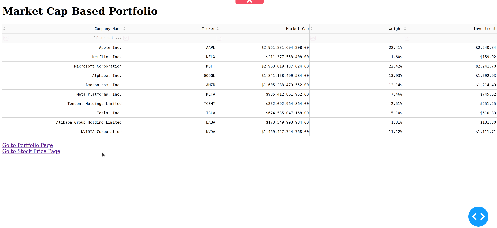

# Tech-Stocks-Dashboard
Dashboard with stock price analysis.

#### See the dashboard in action: 

This is an interactive dashboard  where users can pick the date range.

### To Do
- use different visualization libary (Plotly, Bokhe)
- add notations when basic trading strategies are present
  - death cross, golden corss etc.
- add recent news from the company to the dashboard

### Files 
- app.py: file to run the dashboard in the webbrowser
- layouts.py: file contains page layout
- utils.py: file contains utlities functions

### How to run
1. Set working directory to folder
2. Activate virtual environment with the relevant libaries installed:
`$ python app.py`
3. Dashboard opens in browser
4. Now you can choose the date range.

### libaries
- dash
- numpy
- pandas
- plotly
- yfinance